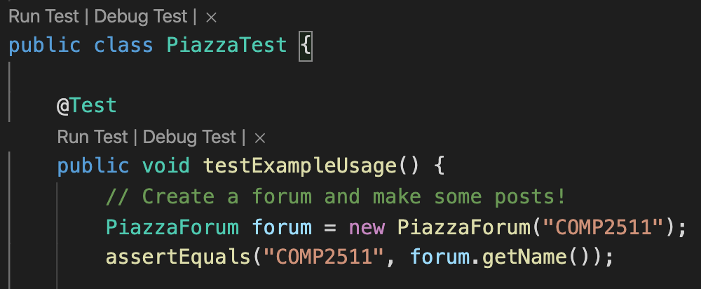

# Lab 01

### Due: Week 2 Monday, 10am

### Value: 2% of course mark

## Changelog

- Sat 29/5 5:30pm:
  - Added some emoji's
  - Fixed up the expected output of the Satellite exercise and clarified some of the instructions
  - Pineapple on Piazza is now correctly marked as a challenge exercise
- Sat 29/5 9:30pm:
  - Fixed Pineapple on Piazza Test
  - Clarified specification that Thread tags should be sorted.
- Sun 30/5 2pm:
  - Fixed up satellite specification making it specify `km/s` for Satellites B's speed
- Sunday 30/5 9pm:
  - Added JUnit section for those running this at home.

## Aims

* Become familiar with course practices for labs
* Learn how to use GitLab effectively
* Learn how to create, compile and run a java program from the command-line
* Gain familiarity with java development using VSCode IDE
* Introduce simple Java exercises based on topics covered in week 1

## Setup

An individual repository for you for this lab has been created for you on the CSE GitLab server. You can find it at this URL (substituting z5555555 for your own zID):

https://gitlab.cse.unsw.edu.au/z5555555/21T2-cs2511-lab01

You will need to log in with your zID and zPass. If you are unable to login please speak to your tutor or lab assistant.

* [Git Setup](git.md)
* [Java Setup](java_setup.md)

## Lab 01 - Exercise - Average 🔢

A class is similar to a struct in the C language in that it stores related data in fields, where the fields can be different types.

1. Open the file `Average.java`. You will find a class named Average.
2. This class defines a method `computeAverage()` that takes in an array of integers and returns the average of this numbers.  You are required to implement this method.
  Hint:
   * To complete this task, you need to compute the sum of the numbers and the total number of elements
   * Use a `for` loop to traverse the list of numbers and compute the sum of the number.
   * Use `nums.length` to get the length of the array, after the sum has been computed.

3. Next, define a `main()` method.

    **Note**: Every Java application needs one class with a `main()` method. This class is the entry point for the Java application and is the class name passed to the `java`  command to run the application. The interpreter executes the code in the `main()` method when the program starts, and is the point from which all other classes and corresponding methods are invoked.

4. Inside the `main()` method, initialise an array of integers and invoke the method `computeAverage()`, passing it as an argument

    **Hint**: `computeAverage()` is an instance method, hence you must create an instance of the class Average and invoke the method on this instance

5. Assign the result of this method to a variable and print the variable

## Lab 01 - Exercise - Splitter 🍌

Modify `Splitter.java` in the examples package such that it reads from `System.in` a line consisting of words separated by a space and prints out the individual words in the string e.g.,

If the input was: `Help I'm trapped in a Java program`
The output should display as:

```
Help
I'm
trapped
in
a
Java
Program
```

Once completed commit and push your changes.

## Lab 01 - Exercise - Satellite 🛰️

A satellite is a moon, planet or machine that orbits a planet or star. In this exercise, you will create an class that represents a satellite, and using this class create a series of Satellite object instances.


Satellites have the following attributes/characteristics:

* A `name` (String)
* A `height` in kilometres above the centre of the earth (integer)
* A `velocity` in metres per second (double)
* A `position`, which is an angle `θ` in **degrees** of the satellite relative to the x-axis, anticlockwise. 
* All of the above attributes can be retrieved using a *getter* function and set using a *setter* function
* The position of the satellite can be retrieved in radians as well as degrees
* The angular velocity of the satellite, (degrees per second) can be found as well as the linear velocity (metres per second)
* Given a length of time in seconds, the distance the satellite has travelled can be found.

You have been given a series of function definitions inside `src/satellite/Satellite.java`. Implement these functions according to the docstrings and above requirements.

Once you have done this, write a `main` method that does the following:
* Creates Satellite A, which is `10000 km` above the centre of the earth, with a velocity of `55` metres per second and at `θ = 122`.
* Creates Satellite B, which is `5438 km` above the centre of the earth, with a velocity of `234` **kilometres** per second and at `θ = 0`.
* Creates Satellite C, which is `9029 km` above the centre of the earth, with a velocity of `0` metres per second and at `θ = 284`.
* For Satellite A, print out `I am {name} at position {theta} degrees, {height} km above the centre of the earth and moving at a velocity of {velocity} metres per second`
* Change Satellite A's height to `9999`
* Change Satellite B's angle to `45`
* Change Satellite C's velocity to `36.5 mps`
* Print out Satellite A's position in radians
* Print out Satellite B's angular velocity
* Print out the distance Satellite C travels after 2 minutes.

### Expected Output

```
I am Satellite A at position 122.0 degrees, 10000 km above the centre of the earth and moving at a velocity of 55.0 metres per second
2.129301687433082
0.04303052592865024
4380.0
```

### Tips

1. You will need to store all of the attributes as fields in the class. This can be done above your constructor by declaring each field. For example:

```java
private String name;
```

You don't have to set the field to be any particular value (they will be `null` by default for objects, and `0` for primitive data types like integers).

2. In the constructor, initialise all of the fields to the parameters using the syntax:

```java
this.name = name;
```

3. You can convert between degrees and radians using `Math.toDegrees(theta)` and `Math.toRadians(theta)`.

4. The formula for conversion between linear and angular velocity is `linear velocity = radius * angular velocity` i.e. `angular velocity = linear velocity / radius`. Think about what the 'radius' is here!

## Lab 01 - Challenge Exercise - Pineapple on Piazza 🍕

In this exercise you are going to (start to) implement your own forum! This week you'll complete a simplified version of the program that involves two classes interacting with one another.

We have designed an object-oriented solution to the following requirements, with class and function stubs in the `src/piazza` package. Your task is to implement the functions according to the specification.

**`Post`**

* At the moment, a post is just a string containing a message.

**`Thread`**

* A `Thread` is created with a title, and a first post;
* Posts can be added to the thread
* A `Thread` has a series of tags, which are just strings.  These tags should be retrieved in a sorted fashion (as per the documentation on `getTags`).

**`PiazzaForum`**

* The `PiazzaForum` contains a list of threads;
* Users can search for threads by tag;

### ArrayLists

In java as well as Arrays, there are ArrayLists - objects akin to a list in python that store a collection of objects that can be dynamically added to and removed from. You can initialise an ArrayList using the following snippet:

```java
List<String> shoppingCart = new ArrayList<String>();
```

### Testing

We have provided some a complete suite of tests for you. You will need the Java Test Runner installed to be able to run the JUnit testes.

You can run the tests by clicking on `PiazzaTest.java` in the VSCode project, and then clicking on `Run Test` under the test class or individual function. Don't worry too much about how these tests work for now - you just need to get them passing.

You can put in debugging print statements by using `System.err.println("message");`, and these can be viewed in the `Debug Console` on VSCode.



#### Installing JUnit 5 on your own computer

You will need to download the JUnit 5 Platform Console Standalone JAR, from the Maven repository (or another repository), and place it into the lib directory. The link to the Maven repository for this is (download by clicking the link "jar (2.1 MB)" next to "Files"):

https://mvnrepository.com/artifact/org.junit.platform/junit-platform-console-standalone/1.7.0-M1

Note that by installing the Java Extension Pack extension in VSCode as required, you will have installed the Java Test Runner extension to run tests with clickable "Run Test" links in the files.

## Lab 01 - Challenge Exercise - Scrabble Subwords 📚

A new version of the popular board game [Scrabble](https://en.wikipedia.org/wiki/Scrabble) is coming out soon, and they want you to write a program to calculate the score for a word on the board.

In this new version of Scrabble, instead of the score for a word placement being the sum of the values of each individual letter, the score for the word is the number of distinct 'subwords' it contains, including itself; if the world is not a subword, its score is 0. 

The definition of a subword is recursive: a subword is constructed by removing one letter from a word. For a subword to be valid, it must bein our dictionary and have at least 2 letters. The subwords for a word should only be recursively generated if the word itself is a valid subword.

Let's have a look at an example. The six subwords for the word lion are `ion`, `'lin`, `in`, `io`, `li` and `on`. (in our dictionary), and so the final score is `7`. Note that even though `lo` is made up of the letters of `lion` and is valid dictionary word, it is not counted because there is not path of subwords  from `lion` to `lo`. 

Inside `Scrabble.java`, your `Scrabble` class should have a constructor that takes in a word, and a method `score` which returns the score for the word. 

We have provided you with the list of dictionary words.

Your program should find subwords in a case-insensitive manner.

We have provided a complete suite of JUnit tests for you.

### Examples

```java
Scrabble s1 = new Scrabble("lion");
System.out.println(s1.score()); // 7
Scrabble s2 = new Scrabble("bread");
System.out.println(s2.score()); // 18
```

Hint: Recursion is your friend

Problem sourced from Grok Learning NCSS Challenge (Advanced), 2016.

## Submission

To submit, make a tag to show that your code at the current commit is ready for your submission using the command:

```bash
$ git tag -a submission
```

Or, you can create one via the GitLab website by going to `Repository > Tags > New Tag`. 

We will take the last commit on your `master` branch before the deadline for your submission.
