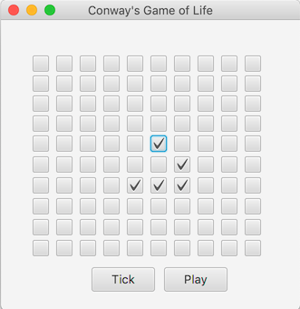

# Lab 05

### Due: Week 7 Tuesday, 8am

### Value: 2% of the course mark

## Aim

* Apply the Observer Pattern
* Learn how to implement a simple stateful model
* Understand JUnit tests
* Learn how to create a basic frontend in JavaFX and connect it to a model (backend)

## Setup

An individual repository for you for this lab has been created for you on the CSE GitLab server. You can find it at this URL (substituting z5555555 for your own zID):

[https://gitlab.cse.unsw.edu.au/COMP2511/21T2/students/z5555555/21T2-cs2511-lab05](https://gitlab.cse.unsw.edu.au/COMP2511/21T2/students/z5555555/21T2-cs2511-lab05)

**REMEMBER** to replace the zID below with your own.

`git clone gitlab@gitlab.cse.unsw.EDU.AU:COMP2511/21T2/students/z555555/21T2-cs2511-lab05.git`

<details>
<summary>If you haven't managed to setup JavaFX yet, follow these instructions.</summary>

## Installing JavaFX on your own system

Delete the *symlink_javafx* symbolic link, then download and unzip the latest version of the JavaFX JDK for Java 11 for your Operating System (taking into account if you have a 64 or 32 bit machine), and transfer the contents of the *lib* folder inside the JDK download into the *lib* folder on your cloned repository. You will also need to change the [*launch.json*](.vscode/launch.json) file to refer to **"./lib"** instead of **./lib/symlink_javafx** in the *"vmArgs"* configuration (note these modifications were tested on Windows 10) as per below;

```diff
{
    "configurations": [
        {
            "type": "java",
            "name": "Launch CheckerApplication",
            "request": "launch",
            "mainClass": "unsw.crown.CheckerApplication",
            "projectName": "lab04_acb2551e",
-           "vmArgs": "--module-path ./lib/symlink_javafx --add-modules javafx.controls,javafx.fxml,javafx.media -enableassertions"
+           "vmArgs": "--module-path ./lib --add-modules javafx.controls,javafx.fxml,javafx.media -enableassertions"
        }
    ]
}
```

You may also need to copy the contents of the *bin* folder in the unzipped JavaFX JDK download into a *bin* folder under the root directory of your cloned repository (e.g. for Windows).

The following version of the JavaFX JDK is recommended if you choose to run it on your computer, since it is the same version as on the CSE machine:

https://gluonhq.com/products/javafx/

Note that if you deviate from this precise directory structure, you may need to modify the VSCode configuration in [*launch.json*](.vscode/launch.json) to be able to run the game in VSCode.

If these steps worked (and you setup java, and the recommended VSCode extensions properly), you should be able to run the starter code game.

## `JavaFX Runtime Components are missing`

If running locally make sure that you've followed the steps above.  If running on VLab/CSE, then make sure that ALL launch configurations in `.vscode/launch.json` contain the line;

```json
"vmArgs": "--module-path ./lib/symlink_javafx --add-modules javafx.controls,javafx.fxml,javafx.media -enableassertions"
```

It's just VSCode creating new configurations rather than recycling the old ones.  This seems 
</details>

## Preparation

Here are a series of videos, lectures and self-learning exercises we recommend you take a look at before completing the lab exercise, or as you complete the exercise to aid in your understanding.

* [21T2 Week 4 Wed Lecture (on JavaFx)](https://d2xnkjysn6lg7q.cloudfront.net/files/unswVideo/transcodes/1624756548088-javafx_wk04_wed/6F4352B1-D6E5-11EB-BFC2065331FB59B2/1624756548088-javafx_wk04_wed-portalHigh-YouTube.mp4), make sure you understand how CheckBox and BooleanProperty work (see 30:52 onwards).
* [JavaFx Self Study Example Video](https://d2xnkjysn6lg7q.cloudfront.net/files/unswVideo/sourceVideo/1594361803294-javafx_selfstudy_example_video.mp4) (17 mins, from 19T3)
* [JavaFx Self Learning Exercise](https://gitlab.cse.unsw.edu.au/COMP2511/javafx-exercise)
* [JavaFx Animation Example Video](https://d2xnkjysn6lg7q.cloudfront.net/files/unswVideo/sourceVideo/1594362993025-javafx_animation_example_video.mp4), explains topics relevant to Part 3, like KeyFrame, Timeline, animation, etc. (13 mins, from 19T3)
* A [recording of the JavaFX example](https://d2svv81k5bdj5l.cloudfront.net/files/unswVideo/transcodes/1594662606951-comp2511_week7_tut_recording_high_quality/334F1CB1-C536-11EA-BBBAFA8260D7B5A1/1594662606951-comp2511_week7_tut_recording_high_quality-portalHigh-YouTube.mp4?Expires=1624671902426&Key-Pair-Id=APKAITQ2UAO4MS3EIK4A&Signature=LnZ5BlGXKnXgv1XuQFqfOfB3U5btMHTQZhbXiQC40ke0kw5NF1lGInWqf567K3v6nYm4HnUKY6H8U3Fd6ijBeXDhIBAaU2dPS~P4fWruNhLcKB7Oh8LtxySLDQnxKa-vlCDiD3CDCQKfqxf3R141XEKiGcf7aRoSr8sKBkcb3zc7qHCwDQeHv4tKJWCF78xdXm~TDXmjFzOw0CEEWdSpGNUzGYAkDggtPxUVrLjYbR8yYaCpJPraf1r~2~L93XSoiyOB8xdb422Z82bWpPLDeplCvMfZpM-z36RdPRmelws81cFA9p4LZ4WsQYPjwc5s27yIKdlTJOZPOCixchsFiQ) from the tutorial

You may find the documentation for the following classes helpful:

* [BooleanProperty](https://openjfx.io/javadoc/11/javafx.base/javafx/beans/property/BooleanProperty.html)
* [GridPane](https://openjfx.io/javadoc/11/javafx.graphics/javafx/scene/layout/GridPane.html)
* [CheckBox](https://openjfx.io/javadoc/11/javafx.controls/javafx/scene/control/CheckBox.html)
* [Timeline](https://openjfx.io/javadoc/11/javafx.graphics/javafx/animation/Timeline.html)
* [KeyFrame](https://openjfx.io/javadoc/11/javafx.graphics/javafx/animation/KeyFrame.html)

## Lab 05 - Exercise: The Game of Life

Consider [Conway's Game of Life](https://en.wikipedia.org/wiki/Conway%27s_Game_of_Life): a zero-player game. The rules of the game (from Wikipedia) are:

> The universe of the *Game of Life* is an infinite, two-dimensional orthogonal grid of square cells, each of which is in one of two possible states, *alive* or *dead*, (or *populated* and *unpopulated*, respectively). Every cell interacts with its eight neighbours, which are the cells that are horizontally, vertically, or diagonally adjacent. At each step in time, the following transitions occur:
>
> * Any live cell with fewer than two live neighbours dies, as if by underpopulation.
> * Any live cell with two or three live neighbours lives on to the next generation.
> * Any live cell with more than three live neighbours dies, as if by overpopulation.
> * Any dead cell with exactly three live neighbours becomes a live cell, as if by reproduction.
>
> The initial pattern constitutes the *seed* of the system. The first generation is created by applying the above rules simultaneously to every cell in the seed; births and deaths occur simultaneously, and the discrete moment at which this happens is sometimes called a *tick*. Each generation is a pure function of the preceding one. The rules continue to be applied repeatedly to create further generations.

For this lab you will be implementing a simplified version of this game. Instead of an infinite grid, the grid will be 10x10 with "wrap-around" behaviour such that cells at the edge of the grid are neighbours with cells on the opposite edge; e.g the cell at position `(9,9)` has neighbours `(8,8)`, `(9,8)`, `(0,8)`, `(0,9)`, `(0,0)`, `(9,0)`, `(8,0)`, and `(8,9)`.

### Part 1 - Backend

Complete the definition of `unsw.automata.GameOfLife` so that it uses a 2D array of `boolean` to store the state of the game. **HINT:** For the `tick()` method, applying the rules in-place won't work; you will need to use a temporary array.

A basic JUnit test has been provided for you in `unsw.automata.GameOfLifeTest`. Make sure the test passes.

Commit your changes for this part of the lab before moving on to the next.

### Part 2 - Observer Pattern

Change the `boolean[][]` array in `GameOfLife` to a 2D array of `BooleanProperty` (from the `javafx.beans.property` package). Update the methods so that the class compiles and works correctly (rerun the test!).

Add a method with the signature

```java
public BooleanProperty cellProperty(int x, int y)
```

to the `GameOfLife` class so that the property can be accessed directly.

Uncomment the second test in `GameOfLifeTest` and fix up any needed imports. If your solution is correct, the test should now compile and pass.

Once again, commit your changes for this part of the lab before moving on to the next.

### Part 3 - JavaFX

Use JavaFX SceneBuilder to build a simple user interface for a game of life application.

SceneBuilder is available on the lab machines at `2511 scenebuilder` and on your own computer by download from [here](https://gluonhq.com/products/scene-builder/#download) (to ensure compatibility, it is best to use the Java 11 version of SceneBuilder as we are using Java 11 in this course).

The UI will consist of two buttons and a grid of checkboxes, like this:



A checkbox that is ticked corresponds to an alive cell. To create that in SceneBuilder:

* Use a `Pane` as the root element
* Add a `GridPane`.
* Add a button to *tick* the game.
* Add a second button to *play* the game.
* Assign an appropriate `fx:id` to the `GridPane` and *play* button.
* Add *On Action* handlers for both the buttons.
* Set the controller to `unsw.automata.GameOfLifeController`.
* Save it as `GameOfLifeView.fxml` in the `src/unsw/automata` directory.

Don't add the checkboxes in SceneBuilder. That is tedious. There are 100 of them!

Add the basic structure to the `GameOfLifeController` class. **HINT:** Like in the tutorial, use SceneBuilder to generate a skeleton.

You should now be able to run `GameOfLifeApplication` and see your UI. However, there are no checkboxes and neither of the buttons will do anything. To fix the first problen, create an `initialize()` method and use it to add 100 instances of `CheckBox` to the `GridPane`.

You can test your application again to see if all the checkboxes are present and correctly arranged.

Next, you will need to connect the UI to the model, similar to how it was done in the tutorial, and then add handlers for the buttons. More concretely:

* Initialise the model in the constructor for the controller.
* Create bidirectional bindings between the cells in the model and the `selected` property of each corresponding `CheckBox`.
* Add a handler for the tick button that triggers a single tick of the game.

Test your application to make sure the *tick* button behaves correctly.

When the *play* button is pressed the game should *tick* ever 0.5 seconds. Use a `Timeline` to implement the this. Specifically, you will need to:

* Create a `Timeline` in the constructor.
* Add a `KeyFrame` to the `Timeline` that calls the `tick()` method of `GameOfLife` ever 0.5 seconds (you'll need to read the documentation for these classes).
* Set the `Timeline` to repeat indefinitely (once again, see the documentation).
* Add a handler for the play button that, at a minimum:
  * Changes the button text to "Stop".
  * Calls the `play()` method of `Timeline`.

Naturally, clicking the button when it says "Stop" should cause the game to stop. You'll need to implement that too.

## Submission

To submit, make a tag to show that your code at the current commit is ready for your submission using the command:

```bash
$ git tag -fa submission -m "Submission for Lab-05"
$ git push -f origin submission
```

Or, you can create one via the GitLab website by going to **Repository > Tags > New Tag**.

We will take the last commit on your `master` branch before the deadline for your submission.
