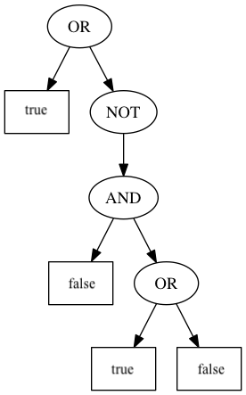

# Lab 07

### Due: Week 7 Sunday, 5pm

### Value: 2% of the course mark

## Aim

* Learn how to unit test randomised functions
* Apply the Composite Pattern
* Apply Design By Contract

## Setup

An individual repository for you for this lab has been created for you on the CSE GitLab server. You can find it at this URL (substituting z5555555 for your own zID):

[https://gitlab.cse.unsw.edu.au/COMP2511/21T2/students/z5555555/21T2-cs2511-lab07](https://gitlab.cse.unsw.edu.au/COMP2511/21T2/students/z5555555/21T2-cs2511-lab07)

**REMEMBER** to replace the zID below with your own.

`git clone gitlab@gitlab.cse.unsw.EDU.AU:COMP2511/21T2/students/z555555/21T2-cs2511-lab07.git`

## Lab 07 - Exercise - The Art of Randomness

Testing code that has an element of randomness is bit of a funny thing. When testing normal code, you will have a deterministic 1:1 mapping of inputs to outputs, i.e. for any given input, you know what the output will be and can assert that the actual output is what you expect. 

The good news is that in computers, there's no such thing as true randomness (though this is not completely true, and you can read [here](https://engineering.mit.edu/engage/ask-an-engineer/can-a-computer-generate-a-truly-random-number/) for more information). Computers generate *pseudo-random* or fake-random numbers that do the job of being random to us pretty well. This means that we can actually test functions where the result is determined by one of these psuedo-random algorithms. 

### Seeds

We can do this by using a common **seed** given to the java `Random` object in `java.util.Random`. Here is an example:

```java
Random rand1 = new Random(1);
Random rand2 = new Random(1);
assertEquals(rand1.nextInt(), rand2.nextInt());
```

The above assertion will always pass.

Using this knowledge, we can use the deterministic result of the `Random` object to write tests.

### Task

Inside `src/random`, in `Game.java` there are is an unimplemented functions named `battle`. This function should return `true` if the hero wins the battle and `false` if they lose. The chance of the hero winning is 0.5. 

There are two constructors for the class; one for testing where the `random` attribute is seeded with the given value, and a default constructor which uses the current time as the seed. The default constructor is for real usage (for example, the `main` method we have provided). 

When the `Random` object is constructed with a seed of `4`, the following values are the results first 8 calls to `.nextInt(100)`:

```
62 52 3 58 67 5 11 46
```

For `-4`:

```
39 13 98 5 43 89 20 23
```

For `0`:

```
60 48 29 47 15 53 91 61
```

* Write at least 2 unit tests for `battle` inside `GameTest.java` using seeds. 
* Once you have done this, implement the function.
* How would you write tests for `Game` with the default constructor that prove the `battle` function works as expected? Think about this and be prepared to answer during marking. You can write your answer down in `random.md`.

## Lab 07 - Exercise - Boolean Logic

[Boolean logic](https://en.wikipedia.org/wiki/Boolean_algebra) is mathematical formalism for descibing logic, named after [George Bool](https://en.wikipedia.org/wiki/George_Boole). Computer scientists love boolean logic because it's all about manipulating binary state. In fact, you're using boolean logic whenever you combine two expressions using `&&` or `||` and when you negate an expresion using `!`. Since you've made it this far through COMP2511, we hope you know how boolean `AND`, `OR` and `NOT` work, but just in case you need a refresher, you can see the [truth tables](https://en.wikipedia.org/wiki/Truth_table) for these operators on Wikipedia.

A Boolean expression is a combination of variables, joined with Boolean operators. We will use parentheses to make the order of operations clear and unambiguous. The following are all valid Boolean expressions for example:

* `x` AND `y`
* `x`
* (`x` OR `y`) AND NOT (`z` OR (`a` AND `x`))

When all of the variables in these expressions are assigned a value (either `true` or `false`), then the whole expression evaluates to either `true` or `false`. 

## Task

Use the Composite Pattern to implement an evaluator for Boolean expressions using a tree of Boolean expression objects. 

Inside `BooleanEvaluator.java` there are two static methods which take in a `BooleanNode` and evaluate, and provide a pretty-printed representation of the node respectively. You will need to use the Composite Pattern to represent a Boolean Expression as a series of composite boolean nodes to allow these functions to work.

For example, the following diagram represents a boolean expression which is an AND expression, and contains two sub-expressions, both of which are leaf boolean nodes. 

Design your solution by creating a UML diagram before implementing it. The JUnit library has been provided if you wish to unit test your work, though you are not required to.


Evaluating this expression would return `false`, and pretty-printing this expression would print:

```
(AND true false)
```

The values of the leaf nodes are defined in the construction of the expression.

Here is another example:


```java
// Pretty print: (OR false (NOT false))
// Evaluates to true
```



```java
// Pretty print (OR true (NOT (AND false (OR true false))))
// Evaluates to true
```

<details>

<summary>Hint</summary>

You can have multiple composite types.

</details>

## Lab 07 - Exercise - The Bank's Contract

Consider a simple Bank system that allows for customers to have accounts. The customers can make deposits and withdrawals, and in this simplified system, an account balance is never allowed to go below 0. 

Inside `src/banking`, create a `BankAccount` class for maintaining a customer's bank balance.
  * Each bank account should have a current balance and methods implementing deposits and withdrawals.
  * Money can only be withdrawn from an account if there are sufficient funds.

In the JavaDoc for the methods, define preconditions and postconditions for the methods.

Then, create a subclass of `BankAccount` called `LoggedBankAccount`, also with the preconditions and postconditions articulated. 
  * Every deposit and withdrawal must make a log of the action.

Inside `bank.md`, answer the following questions in a few sentences:

* Explain why the code is consistent with the preconditions and postconditions.
* Explain why *balance >= 0* is a class invariant for both classes.
* Are your class definitions consistent with the Liskov Substitution Principle?

## Lab 07 - Challenge Exercise - Rational Numbers

In many situations (both in OOP and procedural programming) you have probably encountered, you have been given some sort of library / ADT / API / class which has a series of methods/routes/functions and allows you to call these methods, and the problem has been to use the methods to make some sort of game, or to make something useful happen.

In this exercise, we're going to reverse the roles. Your friend Attila has written a program inside `FunFractions.java` which plays a game for kids learning about fractions. 

We don't want to use Java `double` floating point numbers for this since they have a limited number of decimal places and [can't accurately represent or manipulate](https://en.wikipedia.org/wiki/Floating-point_arithmetic#Accuracy_problems) all rational numbers (fractions). You must create your own `Rational` class to store and manipulate rational numbers.

Attila's job is to implement the game which uses the `Rational` class that you will write. Unfortunately, Attila didn't consult with you to come up with an interface, or contract between the class and the class user and just assumed what the methods would be. His solution doesn't currently compile and is commented out.

Your task is to firstly write the declaration for the `Rational` class inside `Rational.java` which specifies the contract, including all preconditions, postconditions and invariants for each of the methods that are not constructors or `toString`. Then, implement the methods so that the game in `FunFractions.java` works.

### Construction and `toStr`

Your class should support creating any valid rational number with a numerator and denominator.

The number ²/₃ is created as `Rational frac = new Rational(2, 3)`.

You do not need to handle zero denominators or any cases of division by zero.

When `toString` is called, your `Rational` class should display in simplified form. For example, `Rational(21, 12)` should be displayed as 1³/₄. The small nubmers must be done using unicode superscript and subscript digits. These have been provided to you in `SUPER_NUMS` and `SUB_NUMS` in `Rational.java`.

### Methods

* The `.equals()` methods should return `true` if the numbers are equivalent. For example `Rational(4, 8)` is equivalent to `Rational(1, 2)`
* The `add`, `subtract`, `multiply` and `divide` methods should all work as expected on two `Rational` objects and return a new `Rational` instance without modifying the originals.

### The Game

When you have implemented all the methods correctly, the game should work like this:

```
What is 4 × 1¹/₄?
0) 5
1) 1⁴/₅
2) ¹/₂
3) 1¹/₅
> 0
Correct!

What is 1 ÷ ²/₅?
0) 1¹/₅
1) ¹/₄
2) 2¹/₂
3) 1
> 1
Incorrect. The correct answer was: 2¹/₂

What is ⁷/₉ - 1¹/₂?
0) 10
1) -¹³/₁₈
2) 3
3) ⁷/₁₀
> 1
Correct!

What is ³/₈ × 1²/₇?
0) 2
1) ²⁷/₅₆
2) 0
3) 1¹/₂
> 
Invalid input. The correct answer was: ²⁷/₅₆
```

## Submission

To submit, make a tag to show that your code at the current commit is ready for your submission using the command:

```bash
$ git tag -fa submission -m "Submission for Lab-07"
$ git push -f origin submission
```

Or, you can create one via the GitLab website by going to **Repository > Tags > New Tag**.

We will take the last commit on your `master` branch before the deadline for your submission.

## Credits

Problems "Boolean Logic" and "Rational Numbers" sourced from NCSS Challenge (Advanced), 2016. 
