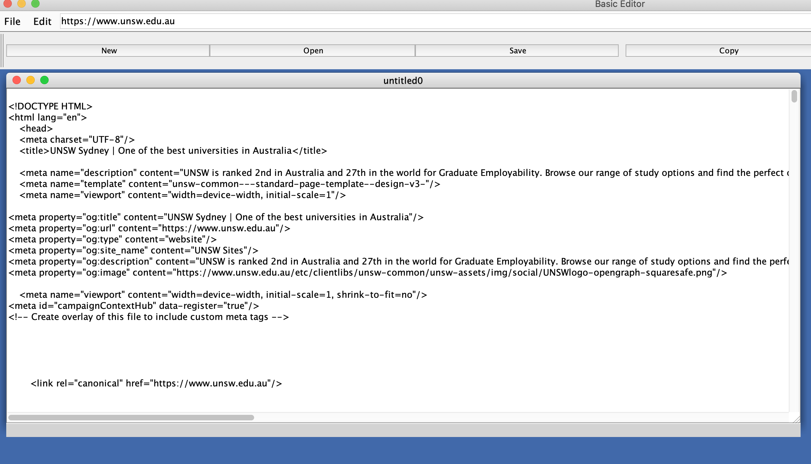
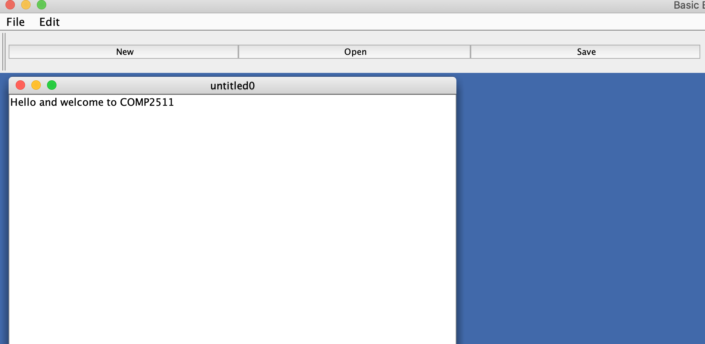
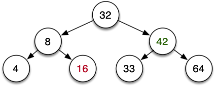

# Lab 10

### Due: Week 10 Sunday, 5pm

### Value: 2 marks towards the Class Mark

This lab will be partially automarked, and partially handmarked.

## Changelog

- 3/8/21 - Updated autotests to include tests for Infix/Postfix in Visitor exercise, and note that contents of `stdout` will be tested.
- 3/8/21 - Change submission instructions to push to master, no submission command required

## Aims

* Apply the Abstract Factory Pattern
* Apply the Visitor Pattern
* Apply the Adapter Pattern
* Work with Threads in Java
* Use the Singleton Pattern to solve simple concurrency problems

## Setup

An individual repository for you for this lab has been created for you on the CSE GitLab server. You can find it at this URL (substituting z5555555 for your own zID):

[https://gitlab.cse.unsw.edu.au/COMP2511/21T2/students/z5555555/21T2-cs2511-lab10](https://gitlab.cse.unsw.edu.au/COMP2511/21T2/students/z5555555/21T2-cs2511-lab10)

**REMEMBER** to replace the zID below with your own.

## Lab 10 - Exercise - Abstract File Editors 💾

Inside `unsw/fileEditor` is code for an application that launches a window that allows the user to edit HTML files. This includes being able to download the raw HTML from a webpage given a URL and save that onto the local computer. For example:



Inside `EditorApplication.java`, if we were to change the variable `editorType` to be `"Text Editor"`, the code would render an application which allows the user to edit files as a normal Text Editor. For example:



Currently, all of the frontend code to render the elements for both types of editors is inside the constructor of `EditorApplication`. At this point in the course you probably find the code excruciatingly painful to look at.

Refactor the code to use the Abstract Factory Patten in the setup and rendering of elements for both HTML files and text files.  Replace the existing constructor of `EditorApplication` so that it takes in an `EditorFactory` and calls all of the respective methods to construct the elements, as well as anything else that may need doing to setup the interface. 

On completion, you should be able to run the `main` function in `EditorApplication` and the application will work as it does currently.

Notes:
* This exercise will not be automarked, so feel free to use whatever classes you like.
* You do not need to setup JavaFX in the `lib` folder for this exercise; the frontend code uses a different GUI Programming framework.
* You will not need to write any frontend code that is not already present to complete this exercise.

## Lab 10 - Exercise - A Visiting Calculator ⏳

In Tutorial 07, we created a simple calculator using the Composite Pattern. That was all very well, but if you recall we had to construct the entire expression ourselves using objects, such as the following:

```java
// (1 + ((2 * 3) / 4)) - 5
Expression expr = new SubtractExpression(
                    new AddExpression(
                        new ModulusExpression(
                            new MultiplyExpression(new ValueExpression(2), new ValueExpression(3)), 
                            new ValueExpression(4)), 
                        new ValueExpression(1)), 
                    new ValueExpression(5));
```

This isn't currently very helpful if we wanted to just take in the expression `1 + 2 * 3 / 4 - 5` and manipulate, print or compute it, which is what we would need to do if we were going to make a real calculator application. This problem is known as **parsing**, which is [an interesting problem](https://en.wikipedia.org/wiki/Parsing) but outside the scope of the course.

Inside `unsw/calculator/model/tree` is some legacy code that uses the Composite Pattern to implement a tree, and will parse a string such as `"1 + 2 * 3 / 4 - 5"`  to construct the expression tree. In this exercise, we want to write code which prints the tree in various notations and evaluates the tree.

If we were building the model from scratch, we would probably just use the Composite Pattern. However, in many legacy codebases you may come across the code will be too complex and/or brittle to simply rewrite or add to easily, and you will instead have to build new functionality around existing code. To do this, we will use the Visitor Pattern.

Use the Visitor Pattern to enable three operations on the Expression Tree:

* Print the Tree using [**infix notation**](https://en.wikipedia.org/wiki/Infix_notation). This is the commonly used notation for articulating arithmetic expressions. Given the above example, the expression in infix notation is `1 + 2 * 3 / 4 - 5`.
* Print the Tree using **postfix notation**, also known as [Reverse Polish Notation](https://en.wikipedia.org/wiki/Reverse_Polish_notation). Postfix Notation prints each of the operands and *then* the operator. For example `3 + 4` would be expressed as `3 4 +`. The above example would be expressed as `1 2 3 * 4 / + 5 -`.
* Evaluates the expression.

Inside `Visitor.java` we have provided you with an interface with two methods: `visitBinaryOperatorNode` and `visitNumericNode`. You will need to:
* Implement these methods in the classes `InFixPrintVisitor`, `PostFixPrintVisitor` and `EvaluatorVisitor` respectively;
* Modify `TreeNode` as needed to ensure that any class that extends/implements it must implement an `accept` method;
* Add an `acceptLeft` and an `acceptRight` method to `BinaryOperatorNode` to allow for the composite accepting of visitors.
* The starter code uses the Composite Pattern for the Infix printing operation to help you out, so you should remove that as well.
* In addition to the above, you also need modify the parsing code to support the modulus operator (`%`) in expressions.

We have provided you with some very basic tests inside `test/calculatorVisitorTest`. They are currently commented out as they don't compile. These tests must pass **without being changed** as our automarking will rely on the same class and method prototypes. You should write some additional tests to ensure your solution passes our autotests.

**We will be testing the contents of `stdout` to check your Infix and Postfix visitors (see the provided tests for an example), so please make sure you remove all your debugging print statements before submitting.**

<details>
<summary>Hint</summary>

In `EvaluatorVisitor`, you may wish to make use of a data structure to help you evaluate the expression.

</details>


## Lab 10 - Exercise - Calculator Adapter 🔌

This exercise follows on from the previous exercise. 

Inside `calculator/view`, there is some frontend code which renders an interface for a simple calculator. Now that we have completed the backend (model), we need to put the two together to create a working app. However, we have the problem that the interfaces between the view and the model are not compatible.

At the moment, there is a method inside the `CalculatorInterface` class `getEvaluator()`, which returns a `DummyEvaluator` object. This method is the point of contact between the backend and frontend - where the frontend can pass the backend an expression to compute and receive the result. Have a look at where this method is called and see how the frontend code works.

The `DummyEvaluator` which `implements Evaluator` has a method which returns `0`, which explains why when you run the application, enter an expression and press `=`, it spits out `0`. 

Your task is to use the Adapter Pattern to connect the backend and frontend. Complete `EvaluatorAdapter` which is of type `Evaluator` and computes a given expression using your code from the previous exercise.

We have provided some tests for you inside `test/calculatorAdapterTest`. These tests must pass **without being changed** as our automarking will rely on the same class and method prototypes. You will also be able to tell that the code is working via a Usability Test (run the `main` method in `CalculatorInterface` and test that the application works as it should).

Note that you will need to write very little code to solve this problem.

## Lab 10 - Challenge Exercise - Money Heist 💰

Consider the Bank Account class from Lab 08. What if multiple people try to access the bank account at the same time? Inside `src/unsw/heist` are three classes:

* `BankAccount`, from Lab 08.
* `BankAccountAccessor`. Objects of this type are an instance of an access to a bank account to withdraw money a given number of times by given amounts.
* `BankAccountThreadedAccessor`, which `extends Thread`, and overrides the method `run` to create a new instance of `BankAccountAccessor` and access the bank.

Currently when you run the code, you will find that each user accesses the bank at the same time (which doesn't make sense). Most of the time this just means that each accessor tries to make as many transactions as they can before the bank runs out of money:

```
The balance is: $100
Rio is accessing the bank.
Denver is accessing the bank.
Tokyo is accessing the bank.
Tokyo successfully withdrew $6
Denver successfully withdrew $49
Rio successfully withdrew $20
Tokyo successfully withdrew $6
Denver failed to withdraw $49.
Rio failed to withdraw $20.
Tokyo successfully withdrew $6
Rio failed to withdraw $20.
Denver is leaving the bank, the balance is $13
Tokyo successfully withdrew $6
Rio failed to withdraw $20.
Tokyo successfully withdrew $6
Rio failed to withdraw $20.
Tokyo failed to withdraw $6.
Rio is leaving the bank, the balance is $1
Tokyo is leaving the bank, the balance is $1
```

In some cases though, some strange behaviour is produced by this **race condition**: 

```
Denver is accessing the bank.
Tokyo is accessing the bank.
The final balance is: $100
Rio is accessing the bank.
Rio successfully withdrew $20
Tokyo successfully withdrew $6
Denver successfully withdrew $49
Tokyo successfully withdrew $6
Denver failed to withdraw $49.
Rio successfully withdrew $20
Rio failed to withdraw $20.
Denver is leaving the bank, the balance is -1
Tokyo failed to withdraw $6.
Rio failed to withdraw $20.
Tokyo failed to withdraw $6.
Rio failed to withdraw $20.
Tokyo failed to withdraw $6.
Tokyo failed to withdraw $6.
Rio is leaving the bank, the balance is -1
Tokyo is leaving the bank, the balance is -1
```

Use the Singleton Pattern to ensure that only one person can access the bank at a time. You can assume for simplicity's sake that only one access to *any* bank account can ever be made at a given time.

## Submission

To submit, make a tag to show that your code at the current commit is ready for your submission using the command:

```bash
$ git tag -fa submission -m "Submission for Lab-10"
$ git push -f origin submission
```

Or, you can create one via the GitLab website by going to **Repository > Tags > New Tag**.

We will take the last commit on your `master` branch before the deadline for your submission.

## Lab 10 - Bonus Exercise - Gratitude ❤️

This exercise isn't marked; it's just here to give you a chance to reflect and wrap up the course.

Inside `gratitude.md` (or maybe somewhere else you're likely to stumble across one day, like a Word Doc or a diary), briefly (or extensively if you want) jot down answers to the following questions:

* What have I learned in this course about good software design?
* What was the biggest challenge of this course for me?
* What is one thing I want to do better? (can be anything)
* What am I excited to learn next?

Once you've done this, go and thank three people who helped you throughout the course. It might be your tutor, your project teammates, or your friends and family who supported you.

<details>
<summary>Click here once you've finished the exercise ;)</summary>
<br/>
Well done :) You made it to the end of COMP2511, and to the end of the 5 Core Computer Science courses at UNSW.

### Roll Credits 

* John Shepherd
* Andrew Taylor
* Richard Buckland
* Ashesh Mahidadia
* Marc Chee
* Hayden Smith
* Robert Clifton-Everest
* Andrew Bennett
* Aarthi Natarajan

<table>
    <tr>
        <td></td>
        <td></td>
    </tr>
    <tr>
        <td></td>
        <td></td>
    </tr>
    <tr>
        <td></td>
        <td></td>
    </tr>
</table>

</details>

Problems "Abstract File Editors", "A Visiting Calculator" and "Calculator Adapter" sourced from [School of Computer Science, University College Dublin](https://csserver.ucd.ie).