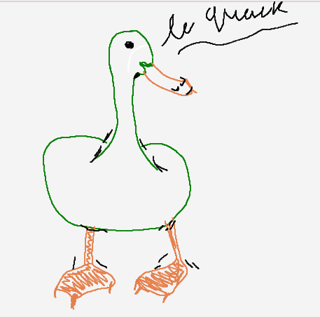
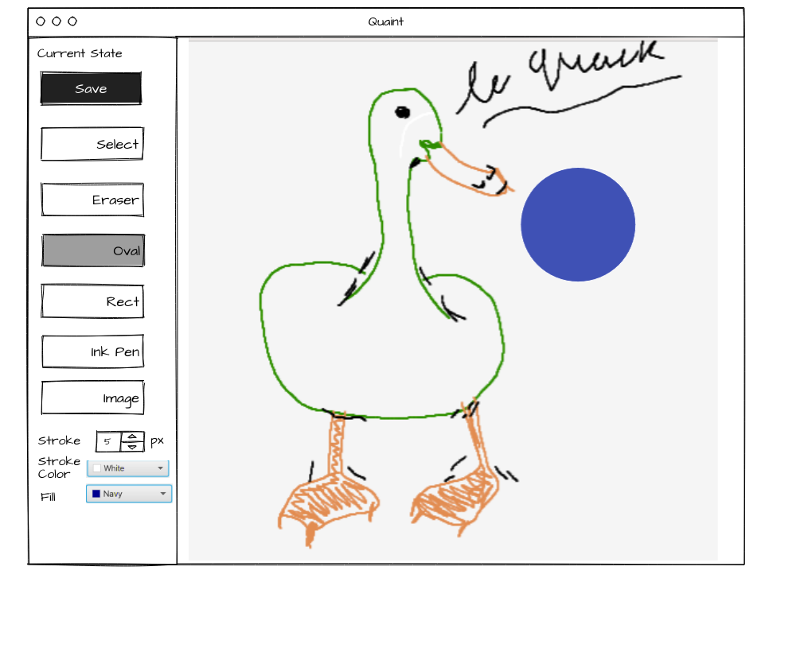

# Tutorial 04

## A. Requirements Analysis Revision

### Part 1

a. Discuss the structure of this user story as a class, and create some acceptance criteria (Given/When/Then and Yes/No).

**As someone who uses GitLab, I want to be able to see all of my repositories currently 'active' so that I don't have to sift through old repos to find my current projects.**

b. What are story points? See [this Atlassian guide](https://www.atlassian.com/agile/project-management/estimation) for more information.

c. How do we prioritise user stories and epic stories? See [this guide](https://www.productplan.com/learn/prioritize-product-backlog/) for more information.

### Part 2

In groups, create user stories and acceptance criteria for the following requirements. Structure these stories under at least one epic story.  You are only going to do 2 out of the many user stories below to demonstrate this (the tutorial answers will have them all).

As a creatively minded individual I want the ability to create beautiful art like the following french duck.

To accomplish this I need the following, you have to

- The ability to draw shapes such as rectangles and ovals, you should be able to give shapes constant aspect ratios by holding shift while dragging
- The ability to select a region then perform operations on it, regions are selected via a box
  - You can delete a region with ctrl + d
  - You can paste a region with ctrl + v, this won't clear the old region and will just paste it (i.e. copy + paste)

Other features that exist that you don't need to write a user story for are:

- The ability to paint using a brush like tool
- The ability to remove mistakes
- The ability to save my picture out to a location of my choosing
- The ability to load an image onto the canvas by clicking the image load tool, selecting the image you want to insert, then clicking where you want to insert it.
  - After placing the image it should return to just the simple cursor.
- The ability to change colours using a colour wheel for the strokes and shapes
- A new pipette tool that appears next to the colour selector that lets you pick the stroke/fill colour based upon the canvas.

For your reference, all the above user stories are implemented in the application specified in the tute.

In case you wish to run the application to understand how these user stories interact you will need to install JavaFX if running locally (or are running into any issues), these instructions are specified in the lab.

## B. Patterns - Strategy and State Pattern

Currently the above specifications have been implemented into a paint application called `quaint`.  It uses strategy patterns to handle various different tools as well as a state pattern to handle the current state of the canvas.

Your task is to investigate the [UML here](Quaint.pdf) and talk about how you would implement the following feature;

- When using the image tool; clicking and dragging should allow you to change the size / position of where the image is placed

Talk about the benefits of having such a state diagram at 'scale' and how state / strategy interact, what their similarities are and what their differences are.

Here is a [simplified version of the UML diagram](QuaintSimple.png) to help you understand the state and strategy pattern, that shows you roughly how the objects are interacting.  It does miss out on some of the nuance with this specific implementation but is great to help the initial understanding of the problem.

## C. Low-Fidelity User Interface Design

Look at the UI we've provided and discuss as a class:
* what's good about it?
* What could be better?

Your tutor will discuss what you should consider when designing a low-fidelity design for a frontend, using this as an example. This will help you with Milestone 1 of the project.

