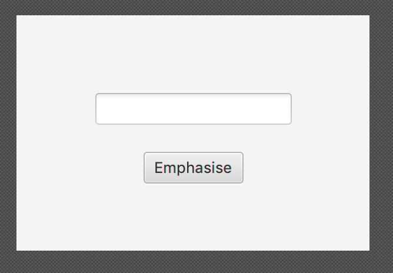

# Tutorial 05

## A. Observer Pattern

In `src/youtube`, create a model for the following requirements of a Youtube-like video creating and watching service using the Observer Pattern:
* A Producer has a name, a series of subscribers and videos
* When a producer posts a new video, all of the subscribers are notified that a new video was posted
* A User has a name, and can subscribe to any Producer
* A video has a name, length and producer

Write a simple test with print statements inside `YoutubeTest.java`.

Once this is done, think about what if we want to be able to produce videos and subscribe to videos as well (the way youtube actually works). In groups, draw a UML diagram refactoring the code so that the `Producer` and `User` classes are merged, whilst still using the Observer Pattern.

## B. JavaFX

As an exercise to learn JavaFX, create a small application that lets the user type in text and click a button to add further emphasis to that text.

### Part 1 - Model & Property-Based Testing

To start with, implement the backend or model for the application.

a. In the `src/emphasis` directory create a class `Emphasis` with a field containing some text (as a `String`) and a stub for a method that changes the field so that the text inside it is *emphasised*.
* Initially, the text should be empty. Add a getter and setter for accessing and updating it.
* If the text already has an exclamation mark at the end, it should be considered sufficiently emphasised already and thus no change needs to be made.
* In this example, text is emphasised by converting it to upper case and adding multiple exclamation points at the end.
b. Write two unit tests for the method.
c. Write a **property-based** unit test for the method.
d. Run the tests
e. Implement the methods.

### Part 2 - String Properties

Change the model so that it uses a `StringProperty` instead of a `String`.

* What's the difference between the two types?
* How should the getter and setter be modified to cope with this change?
* Can the tests be run again without modification?
* Add a method for accessing the `StringProperty` directly. Follow the convention JavaFX uses for this.

### Part 3 - Scene Builder

Create the UI using JavaFX SceneBuilder.

**NOTE:** You can run the JavaFX SceneBuilder from CSE computers with `2511 scenebuilder`.

* Use the empty template.
* Create a `Pane` as the root element.
* Add a `TextField` and give it an `fx:id` of `text`.
* Add a `Button` with the text "Emphasise" and give it an *On Action* handler `handleEmphasis`.

Layout the UI elements like so:

Save the FXML document in the tutorial project under the `src/examples/emphasis` directory.

### Part 4 - Controller

Create an `EmphasisController` class to act as a controller for the UI. You can generate a skeleton of a controller from within SceneBuilder. Under *Controller* on the left menu, make the *Controller Class* `examples.emphasis.EmphasisController` then click on *View* and *Show Sample Controller Skeleton*.

* Why does one of the UI controls have a corresponding field in the controller, but the other doesn't?
* Informally, what does the `@FXML` annotation do?
* Add a field for the model (`Emphasis`). Does this field need an `@FXML` annotation?
* Add a constructor that creates the model. It needs to take no arguments so that JavaFX can automatically construct it when it loads the FXML file.
* Complete the `handleEmphasise()` method such that it takes the text from the text field, passes it to the model, adds the emphasis then puts it back into the text field.
* Create an empty `initialize()` method with an `@FXML` annotation. When will this method be called?
    * In the method, create a **bidirectional binding** between the text in the text field and the text stored in the model

### Part 5 - View

Create an `EmphasisApplication` class that extends `javafx.application.Application`. Override the `start(...)` method to load the FXML document into a `Scene` and display it in a window. Add a `main(...)` method to launch the application. Run the application to make sure everything works.